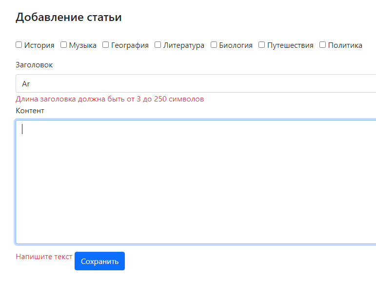
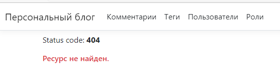
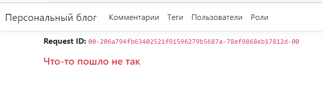
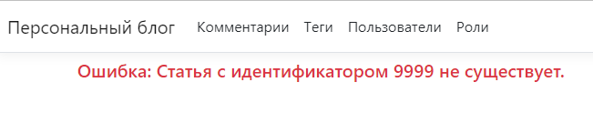
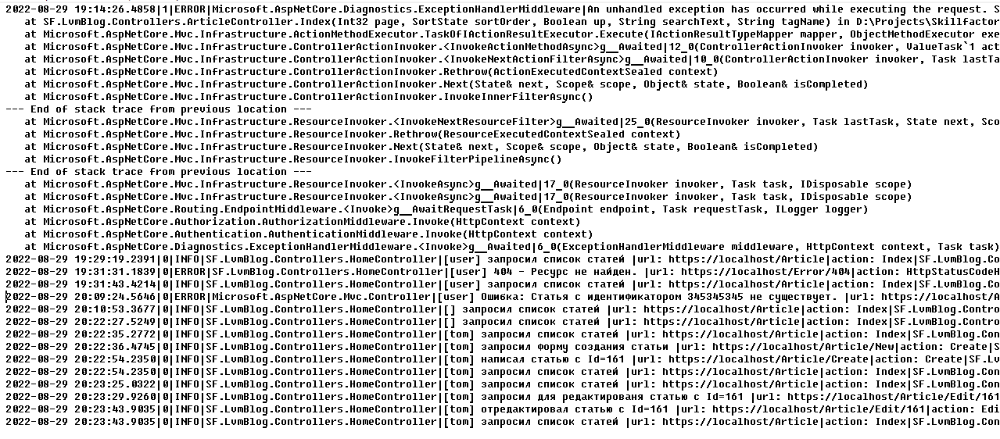
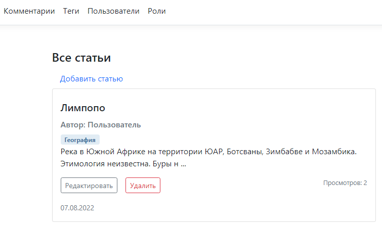
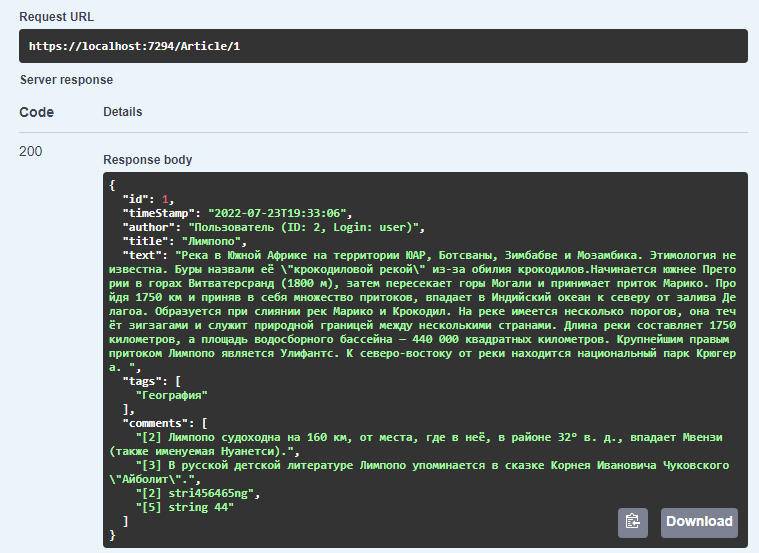

### Этап 3 — Валидация моделей, обработка ошибок, логирование

* Во все модели добавлены проверки на наличие некорректных данных

* В файле Program.cs включена обработка ошибок HTTP:

 и исключений:

Ошибки пользователя отображаются отдельным представлением:

* Настроено логирование через библиотеку NLog:

### Этап 2 — Разработка представлений

* Созданы представления для сущностей _Пользователь_, _Роль_, _Статья_, _Тег_, _Комментарий_.
* Для каждой сущности в проекте LvmBlog созданы контроллеры, реализующие CRUD операции.
* Тестировать представления удобнее под учетной записью admin/123

### Этап 1 — Проектирование и разработка бэка

* Созданы сущности _Пользователь_, _Роль_, _Статья_, _Тег_, _Комментарий_ в базе данных.
* Для каждой сущности созданы контроллеры, реализующие CRUD операции.
* С целью тестирования БД контроллеры созданы пока только в проекте BlogApi. 
Бизнес-сущности находятся в каталоге SF.BlogApi/Contracts

